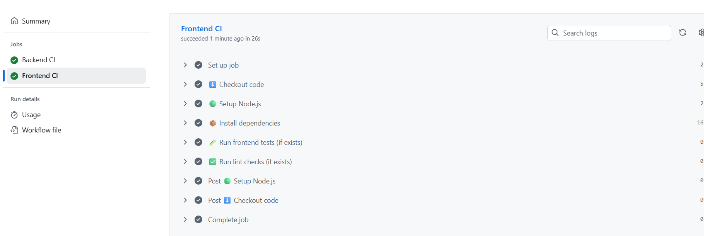
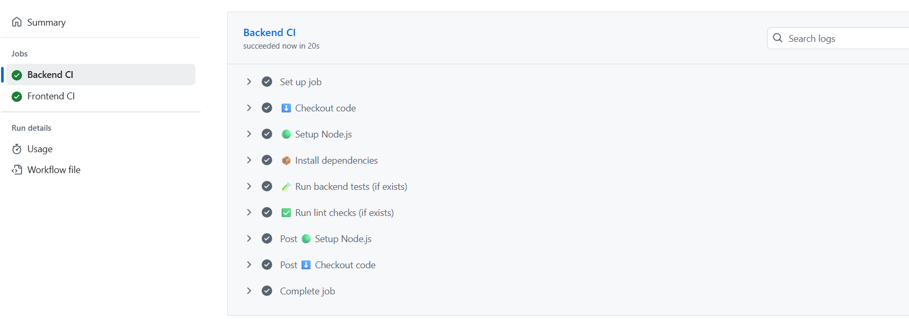
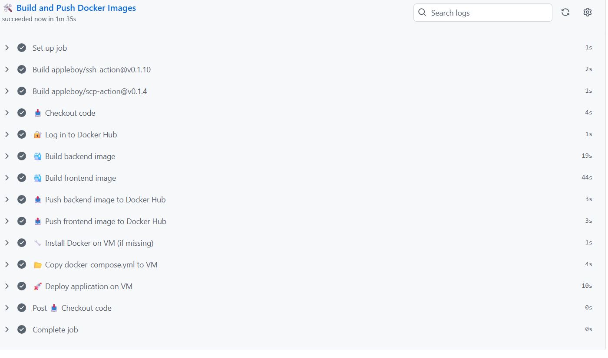

## 🧪 Continuous Integration (CI) Workflow

This project includes a GitHub Actions workflow that automatically runs on every push to the main branch.
This **CI pipeline** automatically build and run test on the app.

### ✅ What It Does

The CI workflow:

1. **Checks out the code**
2. **Installs Node.js dependencies**
3. **Runs ESLint checks**
4. **Runs unit tests**

### 🧲 Trigger

The workflow runs automatically on:

yaml
on:
  push:
    branches:
      - main


Any push to the main branch will trigger the CI pipeline.

---

### 📁 Workflow File

Path: .github/workflows/ci.yml

### 🧱 CI Workflow Logic

yaml
    
    name: 🚀 CI Pipeline
  
        on:
          push:
            branches:
              - main
          pull_request:
            branches:
              - main
        
        jobs:
          backend-ci:
            name: Backend CI
            runs-on: ubuntu-latest
        
            defaults:
              run:
                working-directory: backend
        
            steps:
              - name: ⬇️ Checkout code
                uses: actions/checkout@v3
        
              - name: 🟢 Setup Node.js
                uses: actions/setup-node@v3
                with:
                  node-version: '18'
        
              - name: 📦 Install dependencies
                run: npm ci
        
              - name: 🧪 Run backend tests (if exists)
                run: |
                  if npm run | grep -q "test"; then
                    npm test
                  else
                    echo "No tests defined. Skipping..."
                  fi
        
              - name: ✅ Run lint checks (if exists)
                run: |
                  if npm run | grep -q "lint"; then
                    npm run lint
                  else
                    echo "No lint script defined. Skipping..."
                  fi
                  
          frontend-ci:
            name: Frontend CI
            runs-on: ubuntu-latest
        
            defaults:
              run:
                working-directory: frontend
        
            steps:
              - name: ⬇️ Checkout code
                uses: actions/checkout@v3
        
              - name: 🟢 Setup Node.js
                uses: actions/setup-node@v3
                with:
                  node-version: '18'
        
              - name: 📦 Install dependencies
                run: npm ci
        
              - name: 🧪 Run frontend tests (if exists)
                run: |
                  if npm run | grep -q "test"; then
                    npm test
                  else
                    echo "No tests defined. Skipping..."
                  fi
                  
              - name: ✅ Run lint checks (if exists)
                run: |
                  if npm run | grep -q "lint"; then
                    npm run lint
                  else
                    echo "No lint script defined. Skipping..."
                  fi
---

### 📸 Screenshots

| GitHub Actions tab showing successful CI run 
| -------------------------------------------- 
|   
|   
---


## 🧪 Continuous  Delivery/Deployment (CD) Workflow

This project includes a GitHub Actions workflow that automatically runs on every push to the main branch.
This **CD pipeline** push Docker images, and deploy them to a remote VM.

### ✅ What It Does

The CI workflow:

1. **Log in to Docker Hub**
2. **Build and Push Docker Images**
3. **Install Docker & Compose on VM (if not already installed)**
4. **Copy `docker-compose.yml` to VM**
5. **Stop Old Containers, Pull New Images & Deploy**

### 🧲 Trigger

The workflow runs automatically on:

yaml
on:
  push:
    branches:
      - main


Any push to the main branch will trigger the CI pipeline.

---

### 📁 Workflow File

Path: .github/workflows/cd.yml

### 🧱 CI Workflow Logic

yaml

    name: 🚀 CD Pipeline
    
    on:
      push:
        branches:
          - main
    
    jobs:
      docker-build-and-push:
        name: 🛠️ Build and Push Docker Images
        runs-on: ubuntu-latest
    
        steps:
          - name: 📥 Checkout code
            uses: actions/checkout@v3
    
          - name: 🔐 Log in to Docker Hub
            run: echo "${{ secrets.DOCKER_PASSWORD }}" | docker login -u "${{ secrets.DOCKER_USERNAME }}" --password-stdin
    
          - name: 🐳 Build backend image
            run: docker build -t ${{ secrets.DOCKER_USERNAME }}/devopscourse-backend:latest ./backend
    
          - name: 🐳 Build frontend image
            run: docker build -t ${{ secrets.DOCKER_USERNAME }}/devopscourse-frontend:latest ./frontend
    
          - name: 📤 Push backend image to Docker Hub
            run: docker push ${{ secrets.DOCKER_USERNAME }}/devopscourse-backend:latest
    
          - name: 📤 Push frontend image to Docker Hub
            run: docker push ${{ secrets.DOCKER_USERNAME }}/devopscourse-frontend:latest
          
          - name: 🔧 Install Docker on VM (if missing)
            uses: appleboy/ssh-action@v0.1.10
            with:
              host: ${{ secrets.VM_HOST }}
              username: ${{ secrets.VM_USERNAME }}
              key: ${{ secrets.VM_SSH_KEY }}
              script: |
                if ! command -v docker >/dev/null 2>&1; then
                  echo "🔧 Installing Docker..."
                  curl -fsSL https://get.docker.com | sh
                  sudo usermod -aG docker $USER
                else
                  echo "✅ Docker already installed."
                fi
    
                if ! command -v docker-compose >/dev/null 2>&1; then
                  echo "📦 Installing docker-compose..."
                  sudo curl -L "https://github.com/docker/compose/releases/download/1.29.2/docker-compose-$(uname -s)-$(uname -m)" -o /usr/local/bin/docker-compose
                  sudo chmod +x /usr/local/bin/docker-compose
                else
                  echo "✅ docker-compose already installed."
                fi
                
          - name: 📂 Copy docker-compose.yml to VM
            uses: appleboy/scp-action@v0.1.4
            with:
              host: ${{ secrets.VM_HOST }}
              username: ${{ secrets.VM_USERNAME }}
              key: ${{ secrets.VM_SSH_KEY }}
              source: "docker-compose.yml"
              target: "/home/${{ secrets.VM_USERNAME }}/"
    
          - name: 🚀 Deploy application on VM
            uses: appleboy/ssh-action@v0.1.10
            with:
              host: ${{ secrets.VM_HOST }}
              username: ${{ secrets.VM_USERNAME }}
              key: ${{ secrets.VM_SSH_KEY }}
              script: |
                cd /home/${{ secrets.VM_USERNAME }}
    
                echo "🛑 Stopping old containers (if running)..."
                sudo docker-compose down || true
    
                echo "🧹 Removing old containers (if any)..."
                sudo docker rm -f backend frontend || true
          
                echo "📥 Pulling latest images..."
                sudo docker pull ${{ secrets.DOCKER_USERNAME }}/devopscourse-backend:latest
                sudo docker pull ${{ secrets.DOCKER_USERNAME }}/devopscourse-frontend:latest
    
                echo "🚀 Starting updated containers..."
                sudo docker-compose up -d
---

### The deployment steps:

### 1. 🛠️ Build and Push Docker Images

* Builds the frontend and backend Docker images using the Dockerfiles.
* Pushes the latest versions to Docker Hub.
* 
---

### 2. 🔧 Install Docker & Compose on VM (if not already installed)

* Connects to your VM over SSH using `appleboy/ssh-action`.
* Installs Docker and Docker Compose if missing.

---

### 3. 📤 Copy `docker-compose.yml` to VM

* Copies only `docker-compose.yml` file to remote VM.
---

### 4. 🛑 Stop Old Containers, Pull New Images & Deploy

* Stops any running containers
* Pulls new backend/frontend images
* Runs `docker-compose up -d` to start updated containers

---

## 🖥️ Verify Application is Updated on VM

### Use `docker ps` to confirm containers are running:

```bash
sudo docker ps
```

> 📸 Screenshot: ✅ Containers running
> 

### Check CD workflow is succesfully :

> 📸 Screenshot: succesfull CD workflow
> 

---

### Access your app in browser:

* http\://\[YOUR\_VM\_IP]:3000 → Frontend
* http\://\[YOUR\_VM\_IP]:5000/api/notes → Backend

> 📸 Screenshot: 🌐 Application running in browser
> 

---

## 🔐 GitHub Secrets Required

To make this work securely, define the following secrets in your GitHub repository:

| Secret Name       | Description                          |
| ----------------- | ------------------------------------ |
| `DOCKER_USERNAME` | Your Docker Hub username             |
| `DOCKER_PASSWORD` | Your Docker Hub password/token       |
| `VM_HOST`         | Your VM’s public IP address          |
| `VM_USERNAME`     | Your SSH username on the VM          |
| `VM_SSH_KEY`      | Your private SSH key (no passphrase) |
