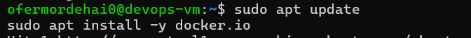
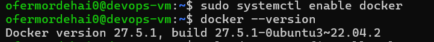
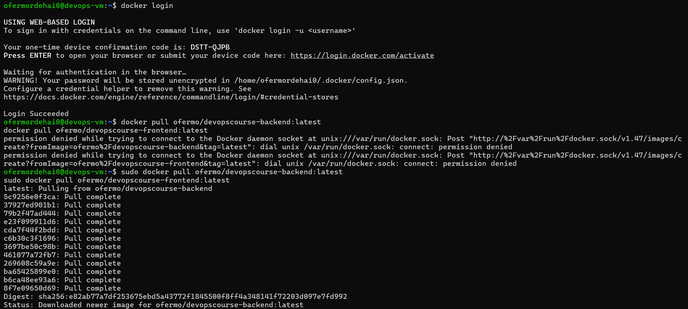
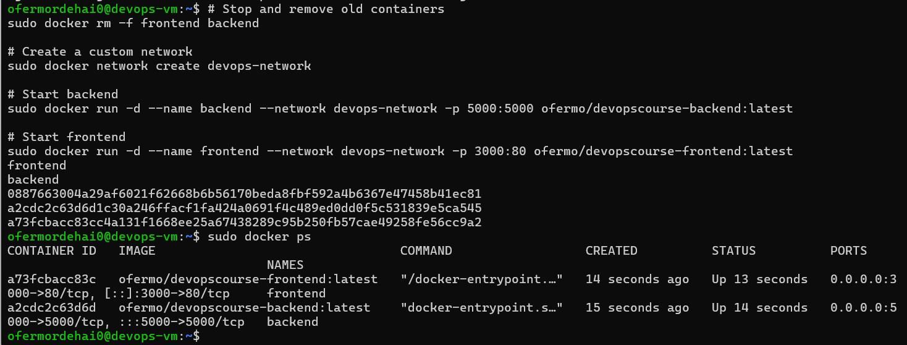
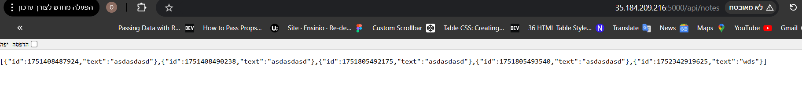

# DevOps Course — Exercise 1, Docker locally

## ✅ Backend

### Dockerfile

Located at: `backend/Dockerfile`

---

## ✅ Frontend

### Dockerfile

Located at: `frontend/Dockerfile`

### Nginx Config

Located at: `frontend/nginx.conf`

---

## ✅ Build and Run Individually

```bash
# Build backend
docker build -t devopscourse-backend ./backend

# Run backend
docker run -d -p 5000:5000 --name devopscourse-backend devopscourse-backend

# Test backend
curl http://localhost:5000/api/notes

# Build frontend
docker build -t devopscourse-frontend ./frontend

# Run frontend
docker run -d -p 3000:80 --name devopscourse-frontend devopscourse-frontend

# Access frontend
http://localhost:3000
```

---

## ✅ Docker Compose

### docker-compose.yml

Located in project root.

Run all services:

```bash
docker compose up -d
```

Stop services:

```bash
docker compose down
```

Check running containers:

```bash
docker compose ps
```

## ✅ Push Images to Docker Hub

Replace `username` with your Docker Hub username.

```bash
docker login

docker tag devopscourse-backend username/devopscourse-backend:latest
docker tag devopscourse-frontend username/devopscourse-frontend:latest

docker push username/devopscourse-backend:latest
docker push username/devopscourse-frontend:latest
```

---

## ✅ Pull Images from Docker Hub

Remove local images:

```bash
docker rmi username/devopscourse-backend:latest
docker rmi username/devopscourse-frontend:latest
```

Pull images:

```bash
docker pull username/devopscourse-backend:latest
docker pull username/devopscourse-frontend:latest
```

Run pulled images:

```bash
docker run -d -p 5000:5000 --name pulled-backend username/devopscourse-backend:latest
docker run -d -p 3000:80 --name pulled-frontend username/devopscourse-frontend:latest
```

---

## ✅ Optional: Push Script

**`push-images.bat`**

```bat
@echo off
set USERNAME='...'
set BACKEND_NAME=devopscourse-backend
set FRONTEND_NAME=devopscourse-frontend
set TAG=latest

docker login
docker build -t %BACKEND_NAME% ./backend
docker build -t %FRONTEND_NAME% ./frontend
docker tag %BACKEND_NAME% %USERNAME%/%BACKEND_NAME%:%TAG%
docker tag %FRONTEND_NAME% %USERNAME%/%FRONTEND_NAME%:%TAG%
docker push %USERNAME%/%BACKEND_NAME%:%TAG%
docker push %USERNAME%/%FRONTEND_NAME%:%TAG%
echo Done!
```

# DevOps Course — Exercise 2, Manual deployment to VM

## 🚀 Deployment Steps

## 1. Deploy a VM

- Create a VM instance in Google Cloud.
- Choose Ubuntu 22.04 LTS as the OS.
- Generate SSH to connect.

## 2. Establish Connection with VM via SSH

I used

- Google Cloud Console “SSH” button
- Local machine with SSH

```bash
ssh ofermordehai0@<VM_EXTERNAL_IP>
```
✅ Screenshot:


---

## 3. Install Docker on VM
Update packages and install Docker:

```bash
sudo apt update
sudo apt install -y docker.io
```
✅ Screenshot:


---

## 4. Enable Docker Service
Enable Docker to start automatically:

```bash
sudo systemctl enable docker
```

Check Docker version:

```bash
docker --version
```
✅ Screenshot:


---

## 5. Open Firewall on Google Cloud
Allow TCP ports needed for your app (80, 5000, 3000) so services are accessible publicly.

✅ Screenshot:


---

## 6. Pull Images from Docker Hub
Pull backend and frontend images onto the VM:

```bash
sudo docker pull ofermo/devopscourse-backend:latest
sudo docker pull ofermo/devopscourse-frontend:latest
```
✅ Screenshot:


---

## 7. Run Containers on VM
 ### Option A — Run Standalone
(Requires adjusting nginx.conf in frontend to point to external backend IP)

```bash
sudo docker run -d -p 5000:5000 --name backend ofermo/devopscourse-backend:latest
sudo docker run -d -p 3000:80 --name frontend ofermo/devopscourse-frontend:latest
```
✅ Screenshot:


 ### Option B — Run in Same Docker Network
Create a Docker network so that frontend can reach backend via hostname backend.

Steps:

```bash
sudo docker rm -f frontend backend
sudo docker network create devops-network
sudo docker run -d --name backend --network devops-network -p 5000:5000 ofermo/devopscourse-backend:latest
sudo docker run -d --name frontend --network devops-network -p 3000:80 ofermo/devopscourse-frontend:latest
```
✅ Screenshot:


---

## 8. Verify Backend Works
Check backend directly:

```bash
curl http://localhost:5000/api/notes
```
✅ Screenshot (Terminal):


✅ Screenshot (Browser):


---

## 9. Verify Frontend Works
```
Navigate in browser: http://35.184.209.216:3000
```
✅ Screenshot (Terminal):

